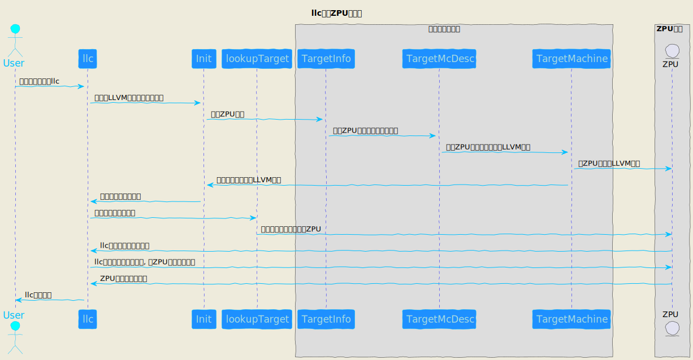
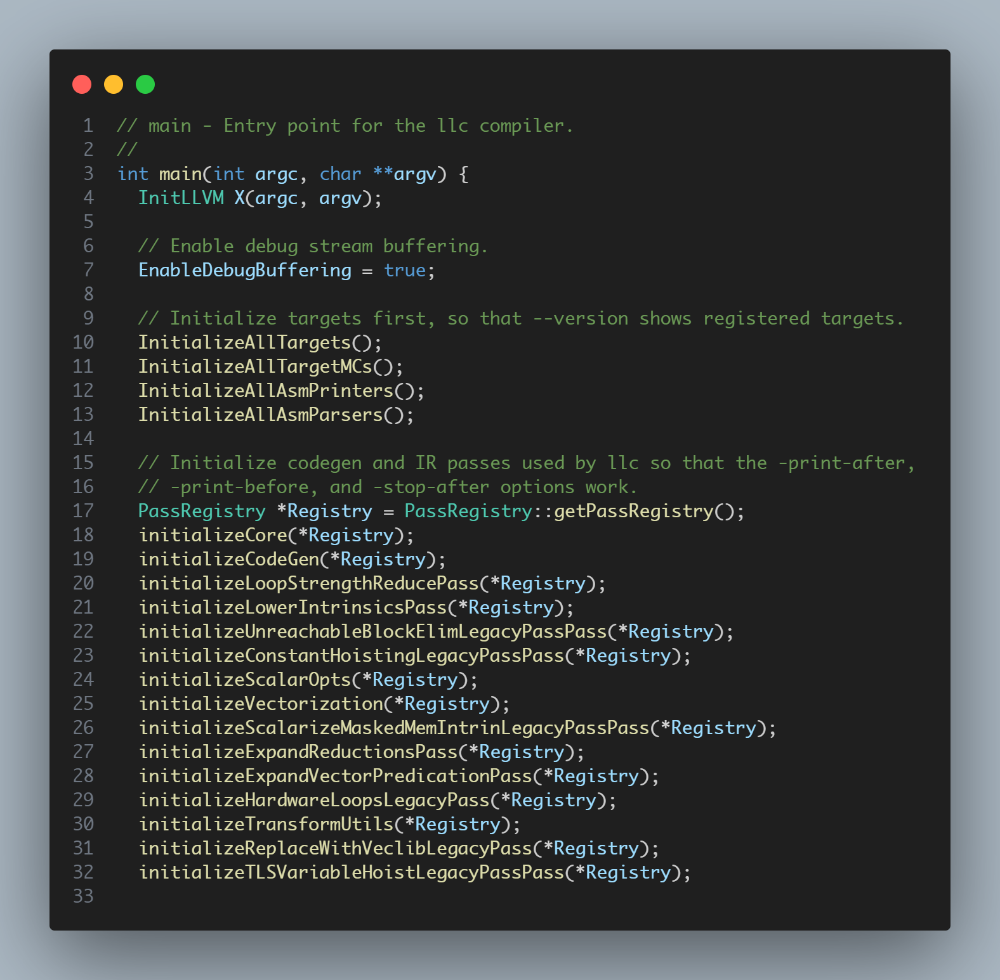
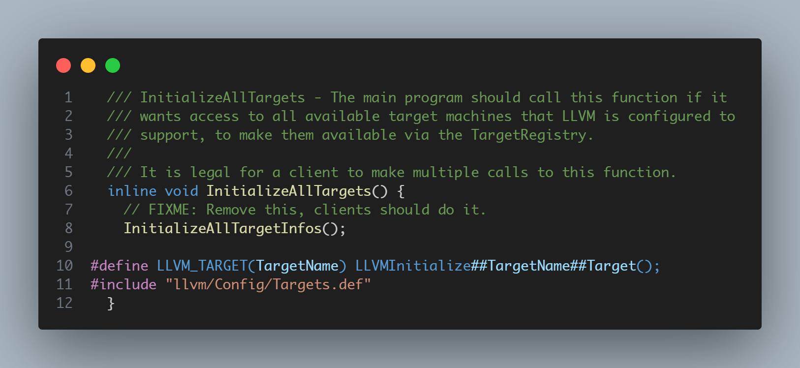
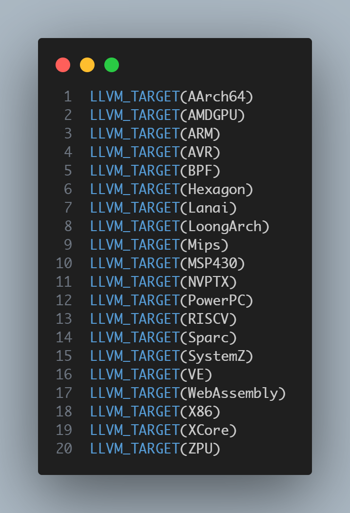
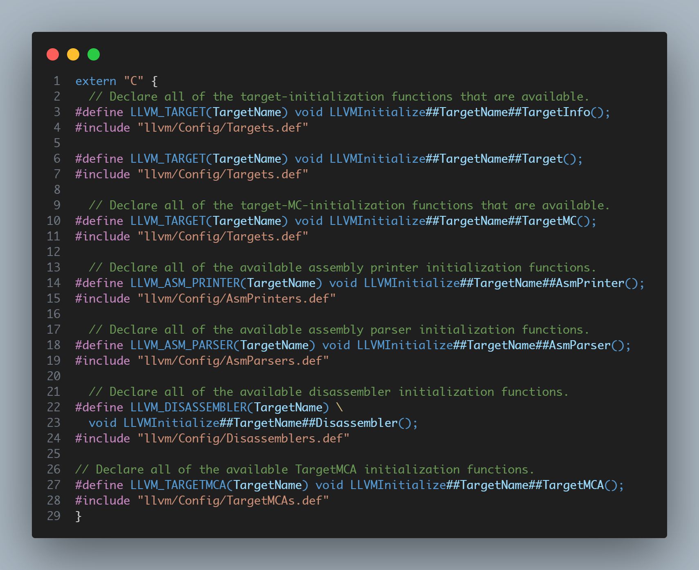
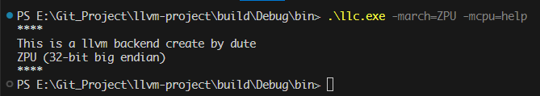

# 初始化一个新处理器后端框架

[toc]

## 1.ZPU新后端初始搭建
在llvm工程中, <strong><font color=Red>llvm/lib/Target</font></strong>目录下, 存储着llvm所支持的所有芯片架构, 有x86, Mips, ARM等, 要填加自己的ZPU后端, 在<strong><font color=Red>llvm/lib/Target</font></strong>目录下新建一个ZPU文件夹;

在ZPU文件夹下分别创建如下文件:
* ZPUTargetMachine.cpp
* ZPUTargetMachine.h
* ZPU.td
* ZPU.h
* CMakeLists.txt
* MCTargetDesc/ZPUMCTargetDesc.cpp
* MCTargetDesc/ZPUMCTargetDesc.h
* MCTargetDesc/CMakeLists.txt
* TargetInfo/ZPUTargetInfo.cpp
* TargetInfo/ZPUTargetInfo.h
* TargetInfo/CMakeLists.txt

<font color=Red>其中除了ZPU.h是可有可无外, 其余文件在搭建一个ZPU后端时, 是必须都要有的</font>

## 2.新增文件简介

在创建完如上文件后, 文件的作用简介如下:

* ZPUTargetMachine.cpp: 定义一个关于ZPU的目标架构, 并注册到LLVM的后端中, 以保证llc可以认识指定的ZPU目标架构
* ZPUTargetMachine.h: 定义一个关于ZPU的目标架构
* ZPU.td: 搭建一个ZPU后端时, 如果是在Windows下使用Visual Studio的集成开发环境进行开发, 只有在ZPU根目录下CMakeLists.txt构建脚本中加入要指定的td文件, 才能使Visual Studio添加关于ZPU的工程项目; 在Linux下不受影响;
* ZPU.h: 可有可无, 目前只声明一个空的头文件;
* CMakeLists.txt: 构建LLVMCodeGenZPU的构建脚本;
* MCTargetDesc/ZPUMCTargetDesc.cpp: 定义一个关于ZPU目标架构格式的描述, 注册到LLVM后端中
* MCTargetDesc/ZPUMCTargetDesc.h: 空头文件, 目前只需声明一个空头文件即可
* MCTargetDesc/CMakeLists.txt: 构建LLVMZPUDesc项目脚本
* TargetInfo/ZPUTargetInfo.cpp: 注册ZPU目标信息
* TargetInfo/ZPUTargetInfo.h: 空头文件
* TargetInfo/CMakeLists.txt: 构建LLVMZPUInfo项目脚本

## 3.LLVM后端注册流程
如图1所示, 一个原始的ZPU后端添加流程,

图1. llc后端初始化
llc会在程序进行的一开始执行初始化所有目标架构的工作, 如图2所示, 在执行初始化的过程中, 将目标架构一一注册到llc中



图2. llc初始化函数与实现
这些初始化函数通过宏拼接(如图3所示), 最终会调用到
* LLVMInitializeZPUTargetInfo
* LLVMInitializeZPUTargetMC
* LLVMInitializeZPUTarget

3个函数来进行ZPU的注册动作;
当前只初始化了<font color=skyblue>TargetInfo, TargetMCs和TargetMachine</font>, 其余的会在后面一一初始化


## 4.执行结果
可以跨平台在windows或者linux的终端中, 输入
```
llc -march=ZPU -mcpu=help
```
查看ZPU的信息如图4所示

表示LLVM的后端llc已经可以识别ZPU了